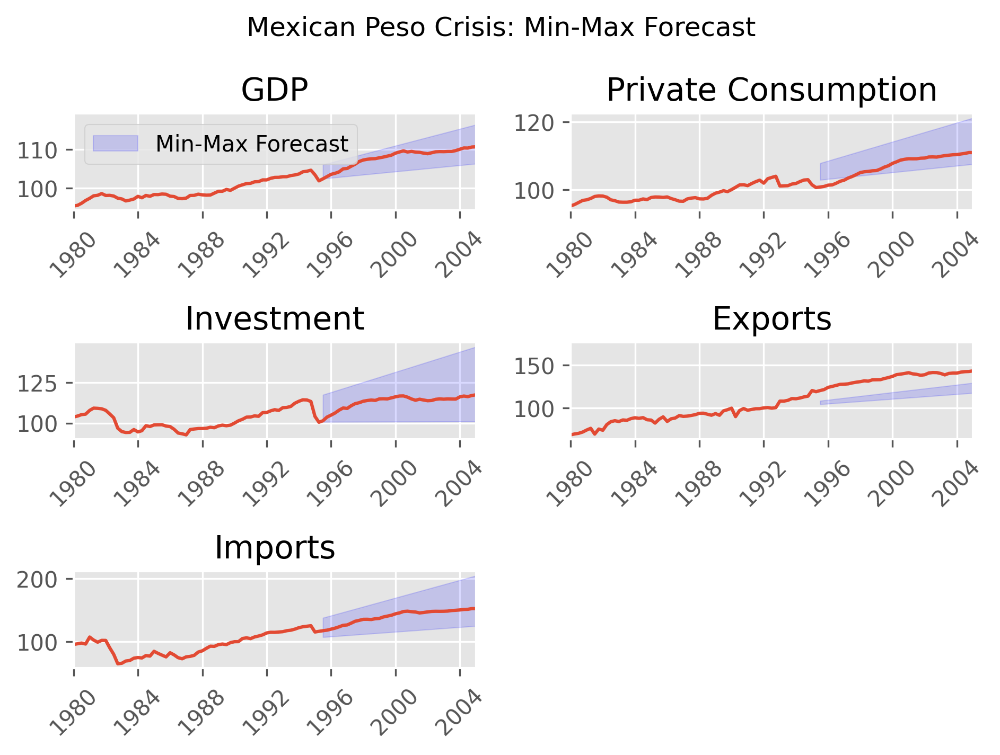
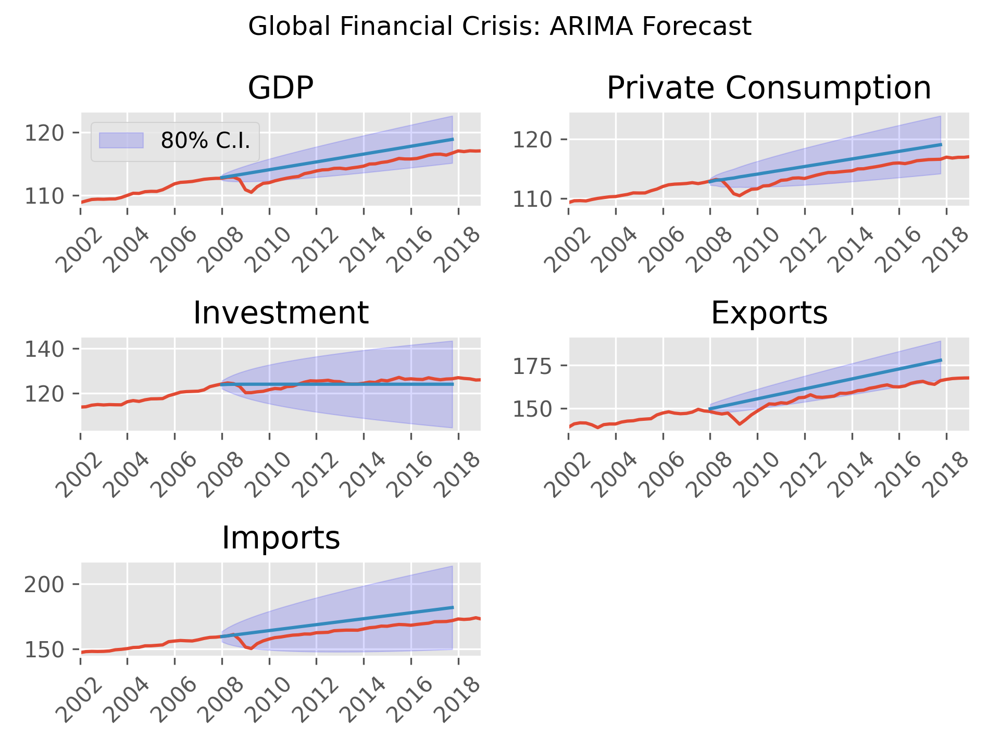
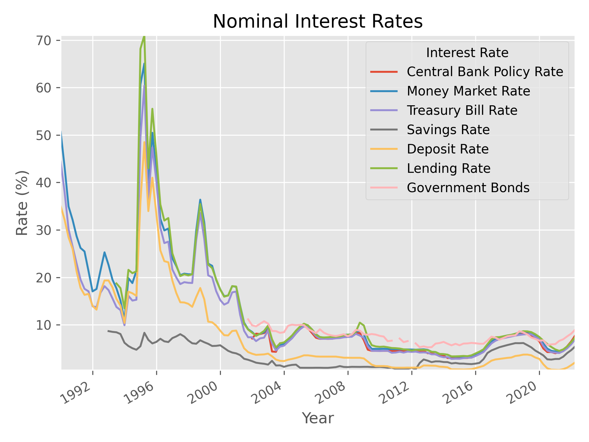

# Forecasting Mexico National Accounts
### Task
This project studies three crisis episodes in Mexico:
- The Mexican Peso Crisis of 1994
- The Global Financial Crisis of 2008
- The Covid-19 Crisis

This project studies whether each crisis produced a permanent decline in the Mexican economy belows its trend. I estimate the trend using two methods:
- Linear regression
- ARIMA forecasting

Further, I study the increase in interest rates observed during the Mexican Peso Crisis.

### Findings
- The Mexican Peso Crisis produced a *temporary* decline in the economy

- The Global Financial Crisis and Covid-19 crisis produced a *permanent* decline in the economy

- The Mexican Peso Crisis featured a significant increase in interest rates, whereas the global financial crisis featured a decrease.

### Data
- Quarterly National Accounts - [OECD Main Economic Indicators](https://www.oecd.org/sdd/oecdmaineconomicindicatorsmei.htm)
- Interest Rates - [IMF International Financial Statistics](https://data.imf.org/?sk=4c514d48-b6ba-49ed-8ab9-52b0c1a0179b)

### Data Wrangling
- Separate trend and cyclical components using Hodrick-Prescott Filter and linear regression
- Forecast trends using linear regression and ARIMA
- Compute real interest rates using CPI and regression
- Linearly interpolate annual population to quarterly levels

### Tools
- Pandas - data wrangling
- Matplotlib/seaborn - visualization
- Sklearn - linear regression forecasting
- autoarima - arima forecasting